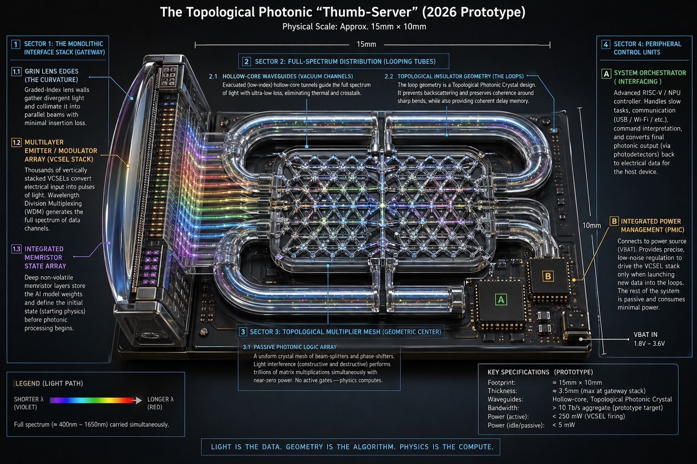
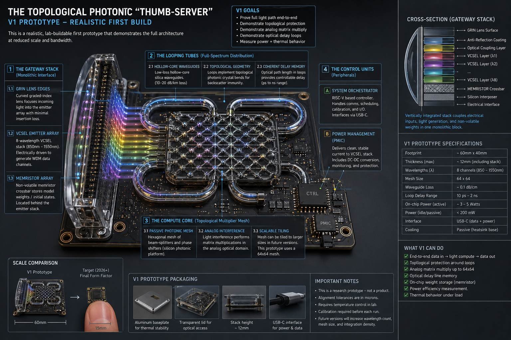
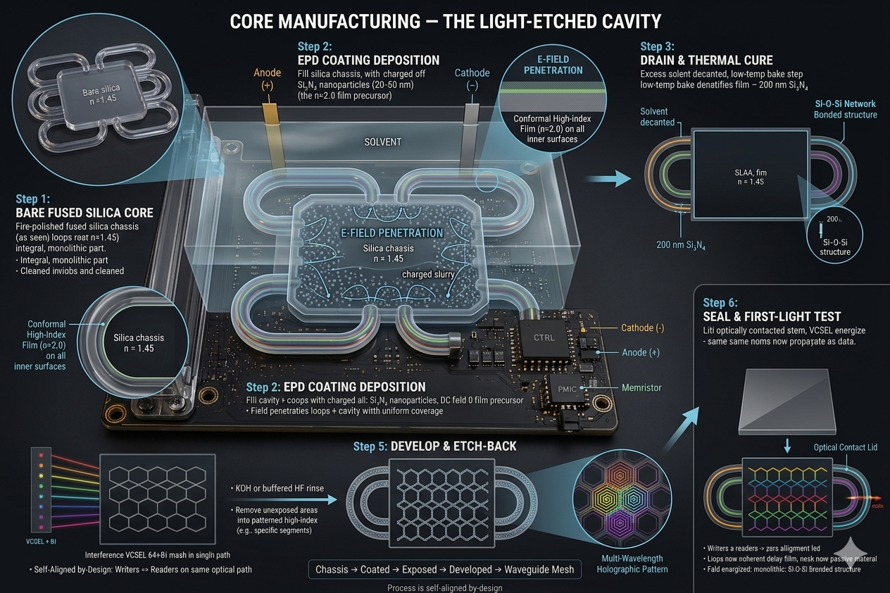
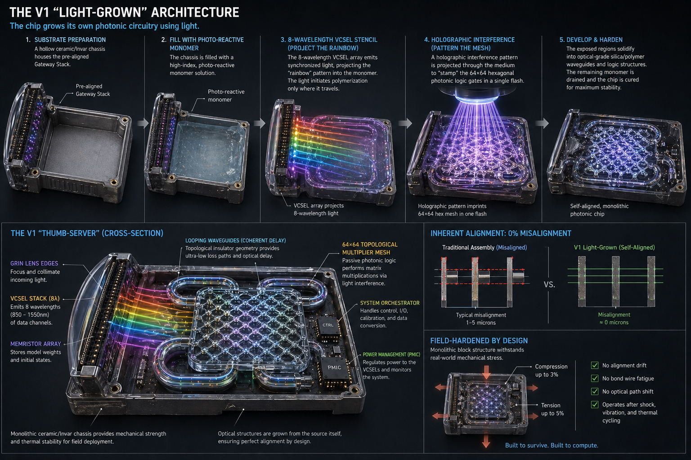
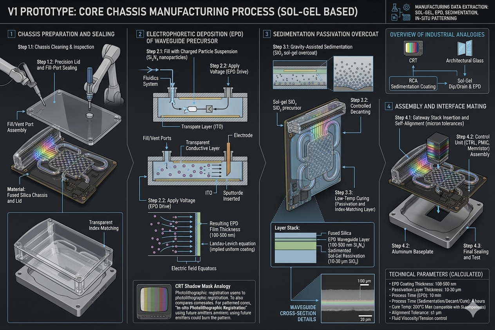
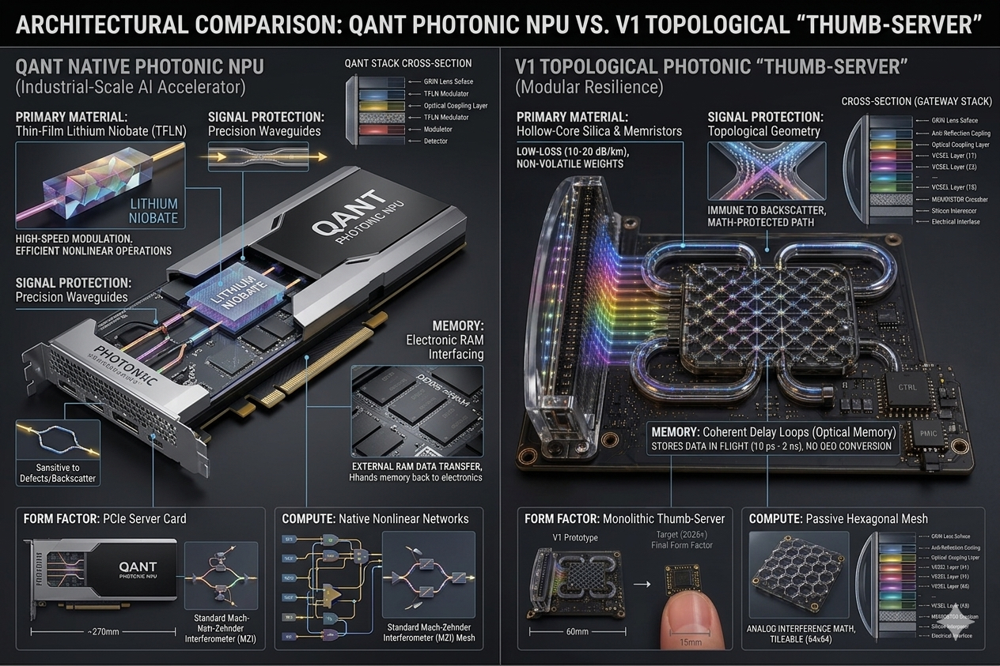

# Topological Photonic Thumb-Server

**Prior Art Disclosure — SGAIL, Inc.**  
**First Public Disclosure: June 22, 2026**  
**Inventor: Christopher Howard**

---

## What This Is

This repository is a formal public prior art disclosure under **35 U.S.C. § 102** (AIA).
It places the photonic compute architecture described below into the public record,
establishing a prior art date that prevents subsequent third-party patenting of these
specific concepts without license from SGAIL, Inc.

This disclosure does **not** waive SGAIL's right to file patent applications on
improvements, implementations, or derivatives of this work.

---

## Concept Summary

A **topological photonic "thumb-server"** — a USB-C-interfaced, passive photonic
compute device performing analog matrix multiplication entirely via light interference
in a monolithic chassis. No moving parts. No active optical switching. Sub-5mW idle.

Target form factor: **≈ 15mm × 10mm × 3.5mm** (thumb-sized at full integration).  
V1 Prototype: **≈ 60mm × 40mm × 12mm** (lab-buildable, full architecture at reduced scale).

### Key Novel Combinations

**1. Writers = Readers**  
The device's own VCSEL array is the lithographic tool during manufacturing.
The same optics that operate the device define its waveguide geometry —
self-alignment by construction. Zero external alignment tooling required.

**2. Topological Loop as Dual-Function Structure**  
Hollow-core topological insulator loops provide backscatter immunity (topological
protection) AND function as coherent optical delay memory simultaneously —
a single passive structure serving two compute roles (10 ps – 2 ns delay range).

**3. Two Manufacturing Pathways, Same Architecture**

- **Method A — Sol-Gel / EPD**: Pre-formed fused silica chassis. Electrophoretic
  deposition of Si₃N₄ nanoparticles (20–50 nm, n=2.0 film precursor) fills the
  cavity. Device's own VCSELs expose the waveguide pattern. KOH/HF etch-back.
  Sol-gel SiO₂ sedimentation passivation. Optical contact lid seal.

- **Method B — Light-Grown**: Hollow ceramic/Invar chassis filled with
  photo-reactive high-index monomer. 8-wavelength VCSEL array projects holographic
  interference pattern — polymerizing the full 64×64 hexagonal mesh in a single
  flash. Field-hardened monolithic block (compression ≤3%, tension ≤5%,
  0 micron alignment drift).

---

## Architecture Overview

```
┌─────────────────────────────────────────────────────┐
│              TOPOLOGICAL PHOTONIC THUMB-SERVER       │
│                    (15mm × 10mm target)             │
│                                                     │
│  [USB-C] ── [Gateway Stack]                         │
│              GRIN lens edges (collimation)          │
│              VCSEL array (8λ, 850–1550nm WDM)       │
│              Memristor weight crossbar (non-vol.)   │
│                    │                                │
│             [Distribution Loops]                    │
│              Hollow-core topological insulator      │
│              geometry (Sector 2)                    │
│              backscatter immune + coherent delay    │
│              memory (10 ps – 2 ns)                  │
│                    │                                │
│             [Multiplier Mesh]  (Sector 3)           │
│              Passive hexagonal beam-splitter /      │
│              phase-shifter array (64×64, tileable)  │
│              Physics computes. No active gates.     │
│                    │                                │
│             [Peripheral Control]  (Sector 4)        │
│              RISC-V / NPU orchestrator (USB-C I/O)  │
│              PMIC (1.8–3.6V VBAT, <250mW active)   │
└─────────────────────────────────────────────────────┘

LIGHT IS THE DATA. GEOMETRY IS THE ALGORITHM. PHYSICS IS THE COMPUTE.
```

---

## Diagrams

| Image | Description |
|---|---|
|  | Full system architecture — all 4 sectors, light path, key specs |
|  | V1 realistic lab prototype — 60×40mm, 8λ, 64×64 mesh, USB-C |
|  | Light-Etched Cavity — Sol-Gel/EPD 6-step process |
|  | Light-Grown Architecture — holographic polymerization in one flash |
|  | V1 Core Chassis Manufacturing — EPD, sedimentation, assembly |
|  | QANT Native Photonic NPU vs. V1 Thumb-Server — architecture and form factor |

---

## Repository Contents

| File | Contents |
|---|---|
| `README.md` | This overview |
| `DISCLOSURE.md` | Full prior art disclosure under 35 U.S.C. § 102 |
| `NOTICE` | Copyright and disclosure date notice |
| `CPC-CLASSES.md` | Patent classification codes (CPC) with relevance mapping |
| `SPECIFICATIONS.md` | Full technical specifications (prototype and target) |
| `MANUFACTURING.md` | Step-by-step manufacturing process documentation (both methods) |
| `images/` | Architecture and manufacturing diagrams |

---

## V1 Prototype Key Specs

| Parameter | V1 Prototype | Target (2026+) |
|---|---|---|
| Footprint | ~60mm × 40mm | ~15mm × 10mm |
| Thickness | ~12mm | ~3.5mm |
| Wavelengths | 8 (850–1550nm) | Full spectrum |
| Mesh size | 64×64 | Tileable |
| Waveguide loss | ~0.1 dB/cm | — |
| Loop delay range | 10 ps – 2 ns | — |
| Power (active) | 3–5W | <250mW |
| Power (idle) | <200mW | <5mW |
| Interface | USB-C | USB-C |
| Bandwidth | — | >10 Tb/s aggregate |

---

## Patent Classifications

Primary CPC codes: `G02B 6/122`, `G02B 6/136`, `H01S 5/183`, `G06N 3/067`,
`G11C 13/00`, `C23C 24/00`, `G03F 7/038`. See `CPC-CLASSES.md` for full mapping.

---

## Rights

Copyright © 2026 SGAIL, Inc. All rights reserved.  
Inventor: Christopher Howard  
Contact: `christopher_howard@live.com`  
Organization: SGAIL, Inc. — North Shore, Oahu, Hawaii

*This repository constitutes citable prior art from the date of first public commit.*
